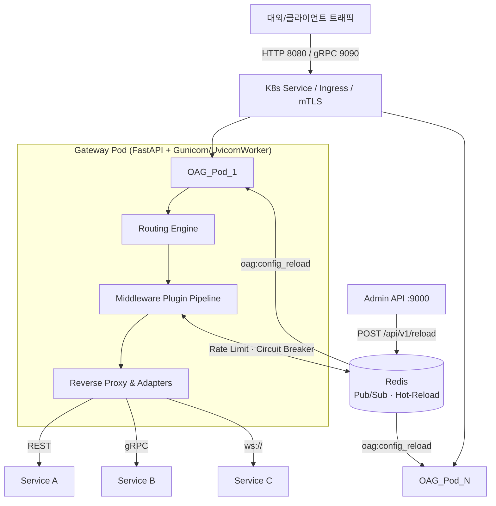

# Open API Gateway 아키텍처 설계서

## 1. 시스템 개요 (System Overview)

본 Open API Gateway (OAG)는 K8s 클라우드 네이티브 환경에서 대규모 마이크로서비스 아키텍처(MSA)의 진입점 역할을 수행하기 위해 구축된 중앙 라우팅 파이프라인입니다. FastAPI(Python ASGI)의 논블로킹 I/O 생태계를 기반으로, 범용적인 HTTP 리버스 프록싱뿐만 아니라 gRPC 바이패싱 및 WebSocket 스트림 멀티플렉싱을 지원합니다.

---

## 2. 코어 아키텍처 (Core Architecture)



---

## 3. 컴포넌트 상세 설계

### 3.1 라우팅 엔진 (Routing Engine)

`config/routes.yaml` 또는 Kubernetes ConfigMap에 선언적으로 정의된 라우트 룰을 기반으로 인입 요청을 매칭합니다.

**매칭 우선순위:** 선언 순서대로 평가하며 가장 먼저 일치한 라우트를 사용합니다(First-match-wins).

**지원 매칭 방식:**

| 방식 | 예시 패턴 | 설명 |
|---|---|---|
| 완전 일치 (Exact) | `/api/v1/users` | 경로가 정확히 같을 때 |
| 와일드카드 (Glob) | `/api/v1/**` | `**`를 포함한 경로 접두사 매칭 (`fnmatch` 기반) |
| 정규식 (Regex) | `~/api/v[0-9]+/.*` | `~` 접두사로 시작하는 정규식 |

**매칭 속성:** `protocol` (HTTP·gRPC·WebSocket), `host`, `path`, `methods`, `headers`

### 3.2 플러그인 체인 (Plugin Chain of Responsibility)

각 요청은 `GatewayContext` 객체를 할당받고 등록된 플러그인 레이어를 **순차적**으로 통과해야만 실제 백엔드(Upstream)로 포워딩될 자격을 얻습니다.

플러그인은 **전역(Global)** 과 **라우트별(Per-route)** 두 계층으로 구성되며, 전역 플러그인이 항상 먼저 실행됩니다.

| 실행 순서 (order) | 플러그인 등록명 | 계층 | 역할 |
|---|---|---|---|
| 1 | `request-id` | Global | X-Request-ID 헤더 주입 및 전파 |
| 2 | `access-logger` | Global | 구조화된 JSON 형식 요청/응답 로그 기록 |
| 5 | `mtls-enforcer` | Per-route | 엣지 LB가 주입한 클라이언트 인증서 헤더(Subject DN) 검사 |
| 10 | `jwt-validator` | Per-route | Bearer 토큰 서명 검증 (JWKS 동적 갱신 지원) |
| 11 | `api-key` | Per-route | X-API-Key 헤더 기반 정적 키 목록 검증 |
| 20 | `rate-limiter` | Per-route | Redis Lua 스크립트 Token Bucket 기반 분산 트래픽 제한 |
| 25 | `circuit-breaker` | Per-route | Redis 분산 상태 기반 Fail-Fast 처리 |

> **플러그인 확장:** `BasePlugin`을 상속하고 `@PluginRegistry.register` 데코레이터를 부착하면 코어 코드 수정 없이 신규 플러그인을 등록할 수 있습니다 (`gateway/plugins/base.py`).

### 3.3 멀티 프로토콜 처리 (Multi-Protocol Handling)

#### HTTP / REST
- `httpx.AsyncClient` 커넥션 풀 기반 비동기 리버스 프록시 (`gateway/core/proxy.py`).
- Hop-by-hop 헤더 자동 필터링, `X-Forwarded-For` · `X-Request-ID` · `X-Gateway-Route` 헤더 주입.
- 업스트림 재시도: 지수 백오프(Exponential Backoff) 기반, 상태 코드·횟수·간격 설정 가능.

#### gRPC
- `grpc.aio.Server`를 FastAPI `_lifespan` 훅 내에서 병렬 구동 (기본 포트 9090).
- `GenericRpcHandler` 기반의 범용 프록시로 `.proto` 파일 컴파일 없이 raw stream-stream 바이패싱 (`gateway/adapters/grpc_proxy.py`).
- REST → gRPC 변환 어댑터 기초 구현 제공 (`gateway/adapters/rest2grpc.py`). 완전한 동적 변환을 위해서는 `grpc_reflection` 연동이 필요합니다 (v2.0 과제).
- **현재 제약:** gRPC 요청은 HTTP 플러그인 파이프라인(인증·Rate Limit 등)을 거치지 않습니다. gRPC Interceptor 연동은 v2.0 과제입니다.

#### WebSocket
- FastAPI catch-all WebSocket 핸들러를 통해 수신 (`gateway/app.py`).
- 업스트림에 먼저 연결 후 클라이언트를 Accept하는 방식으로 **Subprotocol 동적 협상** 수행.
- 텍스트/바이너리 프레임 양방향 멀티플렉싱 (`asyncio.gather` 기반 concurrent pumping, `gateway/listeners/websocket_listener.py`).

### 3.4 로드 밸런싱 전략 (Load Balancing)

| 전략 | 설정값 | 구현 방식 |
|---|---|---|
| Round Robin | `round_robin` | `request_id` 해시 기반 stateless 분산 |
| Random | `random` | `weight` 가중치 기반 확률적 선택 |
| IP Hash | `ip_hash` | `X-Forwarded-For` 기반 클라이언트 IP 해시 고정 |

> `least_connections` 전략은 stateful 카운터가 필요하므로 현재 미지원입니다 (v2.0 과제).

### 3.5 스레딩 및 컨커런시 (Concurrency)

- `asyncio` 이벤트 루프 + `httpx.AsyncClient` 커넥션 풀 기반 비동기 I/O로 처리 대기(I/O Wait) 최소화.
- Python GIL 한계 극복을 위해 **Gunicorn + UvicornWorker** 멀티 프로세스 구조 채택. `WORKERS` 환경변수로 워커 수 조정 가능.
- K8s HPA(HorizontalPodAutoscaler)를 통한 CPU·메모리 기반 Pod 수평 확장 (CPU 70%, 메모리 80% 임계치).

---

## 4. 고가용성 및 무중단 배포 (High Availability & Zero-Downtime)

### 4.1 동적 설정 핫-리로드 (Dynamic Hot-Reload)

설정 변경은 두 가지 독립적인 경로로 트리거됩니다.

**경로 1 — Admin API 명시 호출 (즉시 반영):**
```
POST /api/v1/reload (Admin API :9000)
  → Redis Pub/Sub publish("oag:config_reload")
  → 모든 Gateway Pod가 구독 수신 → 각자 routes.yaml 리로드
```

**경로 2 — ConfigMap 파일 감시 (자동 감지):**
```
ConfigFileWatcher (os.stat 폴링, 5초 간격)
  → routes.yaml mtime 변경 감지 → 해당 Pod 로컬 리로드
```

> **K8s ConfigMap 반영 지연:** Kubelet 동기화 주기로 인해 ConfigMap 변경이 마운트 볼륨에 반영되기까지 최대 약 1분이 소요될 수 있습니다. 즉각 반영이 필요한 경우 Admin API 호출(`POST /api/v1/reload`)을 권장합니다.

### 4.2 Kubernetes 매니페스트 (K8s Lifecycle)

| 컴포넌트 | 설정 | 상태 |
|---|---|---|
| **Liveness Probe** | `GET /_health` — Redis PING 체인 점검. 실패 시 K8s가 파드 재시작 | ✅ 구현 완료 |
| **Readiness Probe** | `GET /_ready` — 파드 트래픽 수신 준비 여부 반환. 롤링 배포 시 미준비 파드 트래픽 차단 | ✅ 구현 완료 (레디니스 조건 강화 권장) |
| **Graceful Shutdown** | `_lifespan` 종료 시 HTTP 프록시 클라이언트 · Redis 커넥션 순차 `aclose()` | ✅ 구현 완료 |
| **preStop 훅** | `lifecycle.preStop.exec: ["/bin/sleep", "10"]` — SIGTERM 전 10초 유예로 iptables 갱신 완료 후 종료 | ✅ 구현 완료 |
| **HPA** | CPU 70% / 메모리 80% 초과 시 최소 2 → 최대 10 Pod 자동 확장 | ✅ 구현 완료 |
| **PDB** | 유지보수/장애 시 최소 1개 이상 Pod 가용성 보장 | ✅ 구현 완료 |

---

## 5. 관측성 (Observability)

### 5.1 구조화 로깅 (Structured Logging)
- `orjson` 기반 JSON 포맷 로그 출력 (`gateway/observability/logging.py`).
- 모든 요청에 `request_id`, `route_id`, `principal`, `duration_ms`, `status` 포함.
- `LOG_LEVEL`, `LOG_FORMAT` 환경변수로 레벨·포맷 제어.

### 5.2 Prometheus 메트릭 (`/metrics`)
- `prometheus-fastapi-instrumentator`를 통해 HTTP 지연율(Latency), 에러율, Throughput 자동 수집.
- 커스텀 메트릭 정의 (`gateway/observability/metrics.py`):
  - `gateway_requests_total` — 라우트·프로토콜·상태코드별 요청 수
  - `gateway_request_duration_seconds` — 라우트별 처리 시간 히스토그램
  - `gateway_circuit_breaker_open` — 서킷 브레이커 개방 여부 (라우트별)
  - `gateway_auth_failures_total` — 인증 실패 카운터

### 5.3 OpenTelemetry 분산 추적
- `opentelemetry-sdk` + `FastAPIInstrumentor` 통합 (`gateway/observability/tracing.py`).
- `OTEL_EXPORTER_OTLP_ENDPOINT` 환경변수 설정 시 Jaeger/Zipkin 등 OTLP 엔드포인트로 스팬 내보내기. 미설정 시 Console 출력.

---

## 6. 보안 고려사항 (Security)

| 항목 | 현황 | 권장 조치 |
|---|---|---|
| Admin API 키 | 환경변수(`ADMIN__API_KEY`)로 주입 | 기본값(`changeme-admin-key`) 반드시 변경 |
| JWT Secret | 환경변수 또는 K8s Secret으로 주입 권장 | routes.yaml에 하드코딩 금지 |
| API Key 목록 | K8s Secret 마운트 권장 | routes.yaml 평문 저장 금지 |
| Admin 포트 노출 | ClusterIP 서비스로 내부망 제한 | 외부 LoadBalancer 노출 금지 |
| gRPC 채널 | 현재 Insecure Channel | 운영 환경에서 TLS 채널로 전환 필요 |

---

## 7. 향후 발전 과제 (Tech Debt & Next Steps for v2.0)

| 과제 | 우선순위 | 설명 |
|---|---|---|
| gRPC 플러그인 파이프라인 통합 | 🔴 High | gRPC Interceptor로 Auth·Rate Limit 적용 |
| `/_ready` 레디니스 조건 강화 | 🟡 Medium | 라우트 로딩 완료 여부 등 실질 조건 추가 |
| gRPC 동적 디스크립터 매핑 | 🟡 Medium | `grpc_reflection` 연동으로 Header 조작·동적 메서드 지원 |
| Prometheus 커스텀 메트릭 연동 | 🟡 Medium | 플러그인에서 실제 메트릭 기록 코드 추가 |
| K8s CRD / Operator 패턴 | 🟢 Low | `GatewayRoute` 커스텀 리소스 기반 네이티브 확장 |
| CI/CD 파이프라인 구축 | 🟢 Low | GitHub Actions + pytest + k6 자동화 |
| Redis Sentinel 지원 | 🟢 Low | 클러스터 토폴로지 자동 갱신 설정 추가 |
